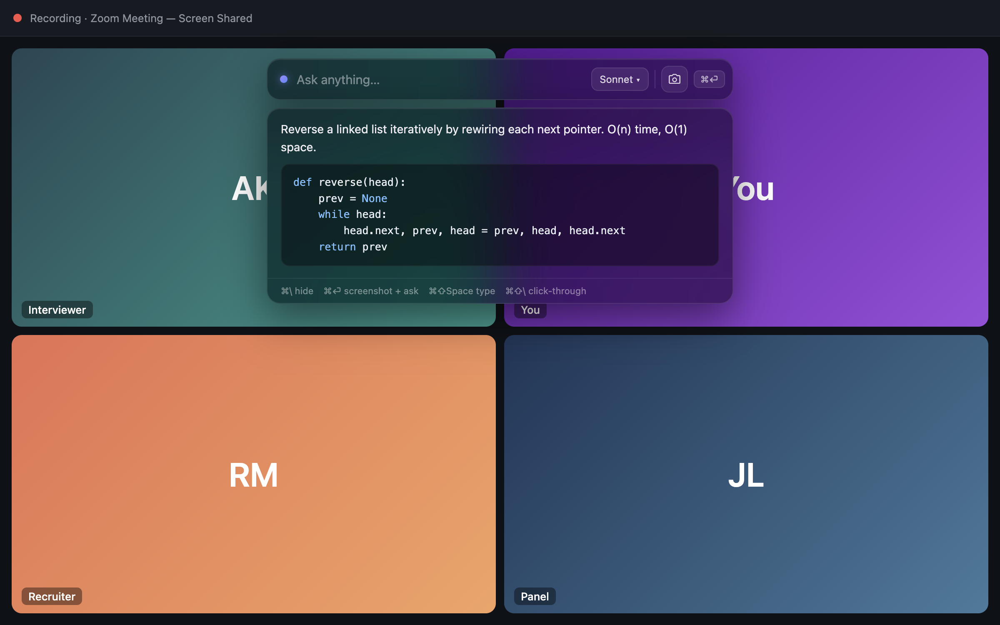

<div align="center">

# Ghostpane

**A translucent AI overlay that's invisible to screen recording, powered by your own Claude subscription.**

[](LICENSE)
[](https://github.com/jappabl/ghostpane/releases/latest)
[](#requirements)
[](https://electronjs.org)



</div>

Ghostpane floats a small glass bar over everything you do. Ask it a question, or press one key to have it read whatever is on your screen, and Claude answers right there. The window is excluded from screen recording and screen sharing, so it never appears in Zoom, Teams, Meet, QuickTime, or OBS. It talks to Claude through the Pro or Max subscription you already have, so there is no API key and no per-token bill.

It's an open take on the idea behind Cluely and Interview Coder, built entirely on documented macOS APIs.

## Please use it responsibly

The screen-capture exclusion is the same OS feature password managers and DRM video players use to keep sensitive windows out of screen shares. There are honest reasons to want it: private notes during your own presentations, teleprompting, accessibility, or just learning how the exclusion works.

Using it to deceive someone who has not agreed to it, like a monitored interview or a proctored exam, is dishonest, probably against that platform's rules, and entirely on you. Don't be a cheater.

## Features

- Excluded from screen shares and recordings on macOS (Zoom, Teams, Meet, screenshots; best-effort against some ScreenCaptureKit recorders and QuickTime).
- Answers from a screenshot: one hotkey grabs what's behind the overlay and sends it to Claude.
- Uses your Claude Pro/Max subscription through the `claude` CLI. No API key.
- Streams answers token by token and grows the window to fit, then shrinks back.
- Never steals focus, has no Dock or app-switcher entry, and follows you across Spaces and over full-screen apps.
- Driven entirely by global hotkeys, so you never move the mouse to a window nobody else can see.
- Pick your model (Opus, Sonnet, Haiku) from the bar.

## Requirements

- A Mac (Apple Silicon or Intel).
- A Claude **Pro or Max** subscription (a free account will not work).
- [Claude Code](https://docs.claude.com/en/docs/claude-code) installed and logged in. That is how Ghostpane reaches Claude.

## Quick start

**1. Install Claude Code and log in.** In Terminal:

```bash
curl -fsSL https://claude.ai/install.sh | bash   # or: brew install --cask claude-code
claude   # then pick "Claude account with subscription", not an API key
```

**2. Download Ghostpane.** Grab the right file from the [latest release](https://github.com/jappabl/ghostpane/releases/latest):

- Apple Silicon (M1/M2/M3): `Ghostpane-<version>-arm64.dmg`
- Intel: `Ghostpane-<version>.dmg`

(Not sure which? Apple menu > About This Mac > look at the chip.)

**3. Install it.** Open the `.dmg`, drag Ghostpane into Applications.

**4. Clear the download flag.** macOS calls unsigned downloads "damaged". They aren't. Run this once:

```bash
xattr -cr /Applications/Ghostpane.app
```

**5. Grant Screen Recording.** Open Ghostpane, press `⌘⏎`, and it opens System Settings for you. Turn on Ghostpane under Privacy & Security > Screen Recording, then quit (`⌘⇧Q`) and reopen.

That's it. Press `⌘\` to summon the bar and start asking.

## Keyboard

There is no Dock icon by design. Everything runs through global shortcuts:

| Action | Shortcut |
| --- | --- |
| Show / hide the overlay | `⌘ \` |
| Type a question | `⌘ ⇧ Space`, then Return |
| Answer what's on screen | `⌘ ⏎` |
| Scroll a long answer | `⌘ ↑` / `⌘ ↓` |
| Click-through on/off | `⌘ ⇧ \` |
| Open the logs | `⌘ ⇧ L` |
| Quit | `⌘ ⇧ Q` |

Pick a model from the dropdown in the bar. Your choice is saved and passed to `claude --model`.

## Verify the exclusion yourself

You do not have to take the "invisible" claim on faith.

- **The 30-second test:** show the overlay, start a QuickTime recording or a Zoom "Share Screen", and play it back. The overlay you see is not in the capture.
- **The rigorous test:** `npm run verify:capture` shows a marker window and captures the screen with content protection off, then on, then off, printing a pass/fail verdict. See [docs/SMOKE.md](docs/SMOKE.md).

## How it works

The magic is one OS capability plus some overlay hygiene:

- **Screen-capture exclusion.** `BrowserWindow.setContentProtection(true)` sets the window's macOS `NSWindowSharingType` to `none`, which drops it from the capture pipeline that Zoom, Teams, and OBS read.
- **Panel window.** The overlay is created as a macOS panel (`NSWindowStyleMaskNonactivatingPanel`) so it can float over other apps' full-screen Spaces, like Spotlight, without stealing focus.
- **Subscription auth.** A small provider spawns `claude -p ... --output-format stream-json` and streams the deltas straight into the UI, drawing from your plan's quota.

The code splits cleanly: the main process owns everything native (the window, hotkeys, capture, and the `claude` provider), a preload script exposes a tiny typed API, and the renderer is a small React app that only draws.

<details>
<summary><b>Troubleshooting</b></summary>

**"Ghostpane is damaged and can't be opened."** It isn't. macOS shows this for any non-notarized download. Run `xattr -cr /Applications/Ghostpane.app`, then open it.

**"Claude Code CLI not found."** Ghostpane looks in the usual install locations. If it still can't find `claude`, redo step 1 and check the log with `⌘⇧L`.

**`⌘⏎` says it needs Screen Recording permission, even after I granted it.** This usually means you are running the app from the disk image or Downloads (macOS "App Translocation"), so the grant does not stick. Move Ghostpane into Applications and open it from there.

**Something is off and I want to see why.** Press `⌘⇧L` to open `~/Library/Logs/Ghostpane/ghostpane.log`. It records startup, which `claude` binary was found, every shortcut, each ask, and the exact CLI exit code.

**It shows up in my recording anyway.** On macOS the exclusion is reliable for Zoom/Teams/Meet sharing and for screenshots, but best-effort against some ScreenCaptureKit recorders and QuickTime. That is a documented macOS limit.

</details>

## Build from source

```bash
git clone https://github.com/jappabl/ghostpane
cd ghostpane
npm install
npm run dev     # live-reload dev build
npm test        # unit tests
npm run dist    # build signed .dmg files into release/
```

The design spec and implementation plan live in [docs/superpowers](docs/superpowers).

## A note on signing

Ghostpane is signed with a self-signed certificate, not an Apple Developer ID. That is enough for macOS to keep your Screen Recording grant across updates, but it still trips Gatekeeper on first launch (hence the `xattr` step). Proper Developer ID signing and notarization would remove that friction; it needs a paid Apple Developer account.

## License

[MIT](LICENSE)
